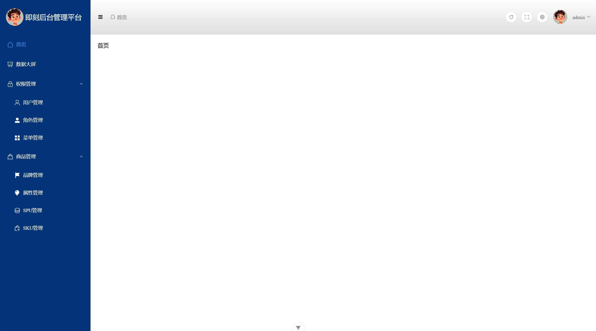

# backend_manage_system（this is frontend project）
# 前端项目，一个后台管理系统，vue3开发
# 数据由项目 volunteer 提供
`git clone https://github.com/yangguohuan/backend_manage_system`  
`cd backend_manage_system`  
`pnpm install`  
`npm run dev`    
 通用后台管理系统前端设计  
 采用前后端分离设计，目前还在制作中  

