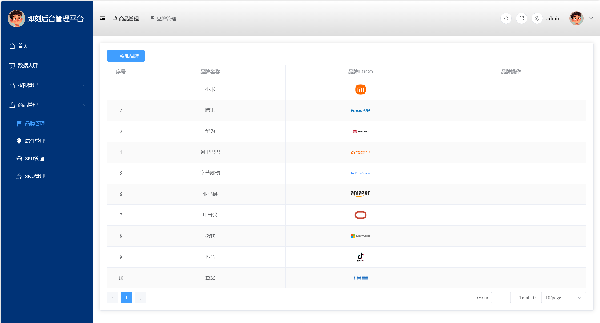
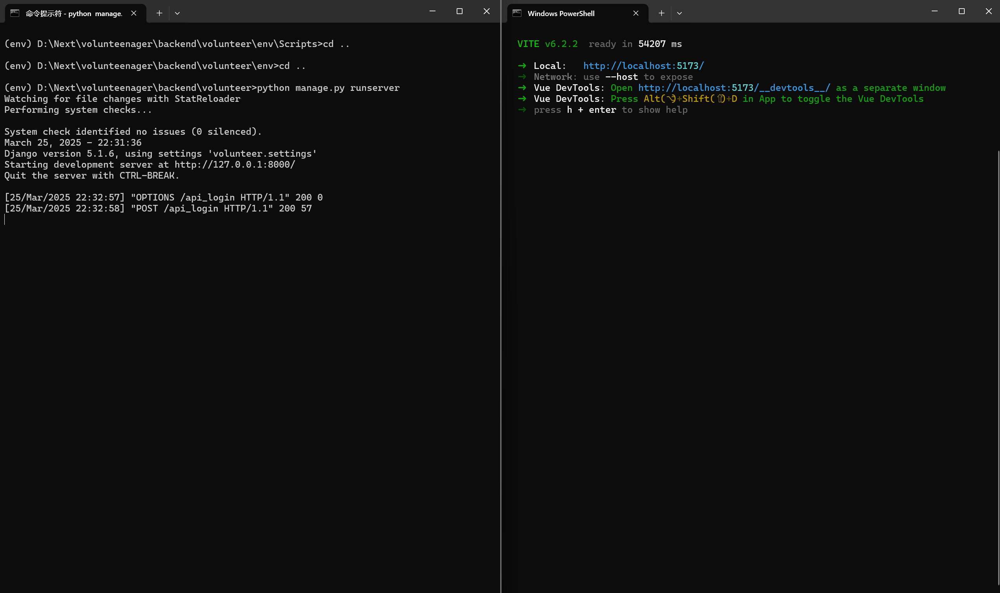

# backend_manage_system（this is frontend project）
## 前端项目，一个后台管理系统，vue3开发
### 数据由项目 volunteer 提供
`mkdir project`  
`cd project`  
`mkdir frontend`  
`cd frontend`  
`git clone https://github.com/yangguohuan/backend_manage_system`  
`pnpm install`  
`npm run dev`     
  
`cd ..`  
`mkdir backend`  
`cd backend`  
`git clone https://github.com/yangguohuan/volunteer`  
`cd env/script/`  
`activate`  
`cd ../../`  
`python manage.py runserver`  
  
 通用后台管理系统前端设计  
 采用前后端分离设计，目前还在制作中  

